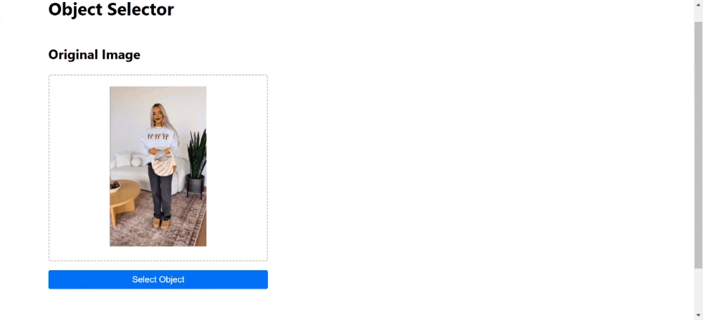

# FastSAM Object Detection Experiment



This project was created as a learning experience to explore computer vision and AI technologies, specifically working with object detection and segmentation models. It served as a practical way to gain hands-on experience with Python backend development while implementing modern AI capabilities. The application provides a basic interface for interactive object detection using FastSAM (Fast Segment Anything Model). Since the emphasis was on backend development and AI implementation, I chose to use JSX over TypeScript to keep the frontend simple and minimize development overhead.

⚠️ **Note**: This is a development/experimental project. The UI is minimalistic and may contain bugs. Error handling is basic and not suitable for production use.

## Features

- Basic drag and drop or file selection for image upload
- Interactive object selection by clicking on the image
- Display of cropped object images
- API response time tracking

## Project Structure

```
├── fe/                    # Frontend directory
│   ├── src/
│   │   ├── components/   
|   |   |── styles/       
│   │   ├── utils/
│   └── package.json
└── be/                   # Backend directory
    ├── main.py           
    ├── models/           # AI model files
    |── utils/
    └── requirements.txt
```

## Setup Instructions

### Backend Setup

1. Navigate to the backend directory:
```bash
cd be
```

2. Create and activate a virtual environment (recommended):
```bash
python -m venv venv
source venv/bin/activate  # On Windows, use `venv\Scripts\activate`
```

3. Install the required Python packages:
```bash
pip install flask flask-cors Pillow numpy ultralytics lapx
```

4. Download the FastSAM model:
   - Create a `models` directory in the backend folder:
     ```bash
     mkdir models
     ```

   - Download the FastSAM-s or FastSAM-x model. If you choose to use FastSAM-x, change `model = FastSAM("models/FastSAM-s.pt")` to `model = FastSAM("models/FastSAM-x.pt")` in be/main.py file.
   - FastSAM-s from [https://github.com/ultralytics/assets/releases/download/v8.2.0/FastSAM-s.pt](https://github.com/ultralytics/assets/releases/download/v8.2.0/FastSAM-s.pt)
   - FastSAM-x from [https://github.com/ultralytics/assets/releases/download/v8.2.0/FastSAM-x.pt](https://github.com/ultralytics/assets/releases/download/v8.2.0/FastSAM-x.pt)
   - Place the downloaded file in the `be/models/` directory

### Frontend Setup

1. Navigate to the frontend directory:
```bash
cd fe
```

2. Install the dependencies:
```bash
npm install
```

## Running the Application

### Start the Backend Server

1. Make sure you're in the backend directory and your virtual environment is activated
2. You may choose to start the app without warmup the model. In that case, change ``is_warmup_model = True`` to `False` in be/main.py file.
3. Run the Flask application:
```bash
python main.py
```
The backend server will start on `http://localhost:5000`

### Start the Frontend Development Server

1. In a new terminal, navigate to the frontend directory
2. Start the Vite development server:
```bash
npm run dev
```
The frontend will be available at `http://localhost:5173`

## Usage

1. Open your browser and go to `http://localhost:5173`
2. Upload an image using drag & drop or the file selector
3. Click the "Select Object" button
4. Click on any object in the image you want to detect
5. The application will display the cropped images of detected objects
6. Use the "Cancel" button to exit selection mode
7. You can select a new file to process at any time

## Known Limitations

- Basic error handling in frontend
- Minimalistic UI with potential bugs
- No loading states for failed API requests
- Limited input validation
- Memory usage not optimized for large images
- No progress indicators for model processing
- Basic CORS configuration
- No input size limitations implemented

## API Endpoints

### POST /api/crop
Accepts JSON payload with:
- `x`: X-coordinate of the clicked point
- `y`: Y-coordinate of the clicked point
- `image`: Base64 encoded image data

Returns:
- Array of detected object images in base64 format
- 200 status code on success
- Error messages with appropriate status codes on failure

## Development Notes

- This is an experimental project focused on learning computer vision and AI implementation
- The primary focus was on the backend and AI integration, with the frontend serving as a basic testing interface
- The frontend is built with React and Vite
- The backend uses Flask and CORS for API handling
- Temporary files are automatically cleaned up after processing
- Code structure is focused on functionality rather than production-ready features
- Node.js v18.16.0
- Python v3.12

## Troubleshooting

If you encounter any issues:

1. Ensure all required Python packages are installed correctly
2. Verify that the FastSAM model file is present in `be/models/`
3. Check that the CORS origins in `main.py` match your frontend URL
4. For large images, you might need to increase your system's available memory
5. If the API returns errors, check the browser console and Python logs for details

## Contributing

This is an experimental project, but suggestions and improvements are welcome. Feel free to fork and experiment with the code.

## License

This project is intended for experimental and educational purposes. Feel free to use the code as you see fit.

## Contact
Project created by [Ido Zamir](https://github.com/owolfy/).
Feel free to reach out through GitHub if you have questions about the project or want to contribute.

## Disclaimer

This application is for development and learning purposes only. It is not intended for production use and comes with no warranties or guarantees.